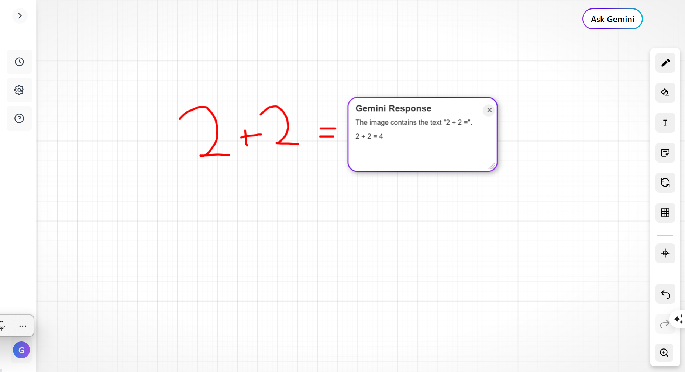

# Sketch AI

## Table of Contents
1. [Overview](#overview)
2. [Features](#features)
3. [Screenshots](#screenshots)
4. [API Reference](#api-reference)

## Overview

Sketch AI is an interactive canvas application that combines drawing capabilities with AI-powered analysis. Users can create sketches, diagrams, or write questions on the canvas, and then use Google's Gemini AI to analyze and respond to the content.

The application features a modern, responsive UI with tools for drawing, text insertion, erasing, and more. When a user asks Gemini to analyze their canvas, the AI identifies questions or elements in the drawing and provides answers directly on the canvas as interactive response cards.

## Features

- **Interactive Canvas**: Draw, write, and create diagrams with intuitive tools
- **AI-Powered Analysis**: Analyze canvas content with Google's Gemini 2.0 model
- **Smart Response Cards**: Get AI responses positioned near the relevant content
- **Rich Toolset**: Pencil, text, note, eraser, and grid tools
- **Canvas Controls**: Zoom, pan, undo/redo, and reset functionality
- **Responsive Design**: Works across different screen sizes

## Screenshots



## API Reference

`POST /gemini/generate`

Request body:
```json
{
  "prompt": "Analyze this image and identify any text, diagrams, or drawings",
  "image": "base64_encoded_image_data"
}
```

Response:
```json
{
  "answers": [
    {
      "id": 1,
      "answer": "This is the AI's response to the content",
      "boundingBox": {
        "topLeft": {"x": 100, "y": 100},
        "bottomRight": {"x": 300, "y": 200}
      }
    }
  ]
}
```